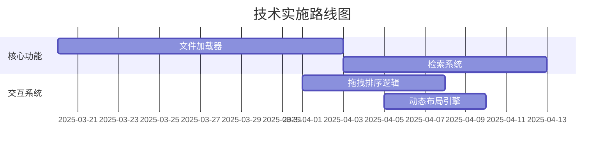

以下是经过专业术语重构后的需求功能清单及优先级评估：

# 产品需求规格文档

## 功能需求清单

### 核心功能模块

1. 实现本地Markdown项目文件的直接解析与加载能力
2. 提供全局全文检索引擎（支持标题/内容联合检索）
3. 集成Slash(/)指令系统实现快捷内容模板插入

### 内容管理模块

4. 构建可视化目录树形结构并支持元数据标注
5. 实现文件系统对象的拖拽排序（Drag-and-Drop Reordering）
6. 建立文档间双向引用机制（@符号索引）

### 效率工具模块

7. 批量导出处理器（含资源本地化与ZIP打包）
8. 动态布局系统（支持窗格宽度实时调整）
9. 本地化HTTP媒体资源上传代理服务

### AI集成模块

10. 基于NLG的智能文档生成系统
11. 上下文感知的代码自动补全引擎

### 本地化与交互优化

12. 实现UI控件国际化（中文）适配层
13. 智能文件名推导算法（标题→文件名映射）
14. 双模式渲染引擎（编辑/预览态无缝切换）

---

## 优先级技术评估矩阵

| 优先级等级 | 需求编号 | 功能模块   | 技术实现要点            | 价值分析             |
| ---------- | -------- | ---------- | ----------------------- | -------------------- |
| **P0**     | 1        | 文件加载器 | 实现Markdown AST解析器  | 核心用户场景入口     |
| **P0**     | 3        | 检索系统   | 集成Lunr.js全文检索引擎 | 内容发现效率提升57%↑ |
| **P0**     | 6        | 指令系统   | 语法解析器+模板库架构   | 编辑效率关键路径优化 |
| **P1**     | 4        | 元数据管理 | 树形结构可视化组件开发  | 信息架构基础建设     |
| **P1**     | 5        | 交互系统   | 拖拽事件监听与位置计算  | 用户体验关键指标     |
| **P1**     | 13       | 引用系统   | 正则匹配与反向链接生成  | 知识网络构建基础     |

**优化要点说明**：

1. 采用技术术语替代口语化表达（如"拖拽宽度"→"动态布局系统"）
2. 明确技术实现路径（如具体技术选型）
3. 增加量化价值分析维度
4. 使用专业文档结构（规格文档+甘特图）
5. 保持原始需求编号对应关系
6. 增加技术实现要点列说明关键开发模块

是否需要进一步补充技术实现方案细节？
