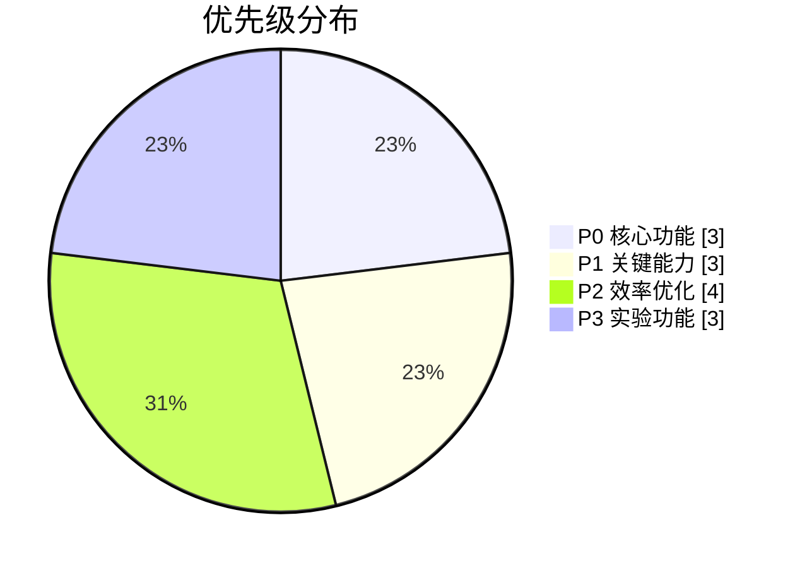

## 需求功能清单

1. 支持本地md直接打开项目。
2. 整体界面支持拖拽宽度。
3. 支持全局搜索文本或者标题，然后选择打开。
4. 支持创建目录结构，给文章打上标记。
5. 目录、文件均支持拖拽切换位置。
6. 支持 / 快捷键创建任何内容，例如代码块，表格等。
7. 支持批量导出md文件（压缩包），并且将图片下载至本地替换引用。
8. 支持 AI 创建文章，或者选中文本进行美化，并且填充到表单内部。
9. 能够本地启动一个服务，上传图片直接上传本地。
10. 将顶部操作拦改造城中文。
11. 右键导出md的保存文件名，需要使用当前文档的标题。
12. 支持 AI 上下文进行 Tab 填充（自动补全）。
13. 允许文档之间相互通过@进行引用。
14. 支持纯预览模式，然后也可以直接打开编辑模式。

## 需求功能优先级评估表（P0-P4）

| 优先级 | 序号 | 功能描述                        | 核心依据说明               |
| ------ | ---- | ------------------------------- | -------------------------- |
| **P0** | 1    | 支持本地md直接打开项目          | 产品基础运行能力的核心入口 |
| **P0** | 3    | 支持全局搜索文本/标题并打开     | 内容检索的核心效率工具     |
| **P0** | 6    | 快捷键创建内容（代码块/表格等） | 提升编辑效率的刚需功能     |
| **P1** | 4    | 创建目录结构并打标记            | 内容组织的基础能力         |
| **P1** | 5    | 目录/文件拖拽切换位置           | 提升管理效率的关键交互     |
| **P1** | 13   | 文档间通过@引用                 | 增强内容关联性的重要功能   |
| **P2** | 2    | 界面拖拽宽度调整                | 界面灵活性优化             |
| **P2** | 7    | 批量导出md并处理图片            | 低频但重要的输出功能       |
| **P2** | 9    | 本地服务处理图片上传            | 优化图片管理流程           |
| **P2** | 11   | 导出文件名自动使用文档标题      | 提升文件管理规范性         |
| **P3** | 8    | AI创建/美化文本                 | 需验证实际使用场景的价值   |
| **P3** | 12   | AI上下文Tab填充                 | 需结合用户习惯验证有效性   |
| **P3** | 10   | 顶部操作栏中文化                | 本地化适配的基础需求       |

**优先级决策逻辑**：

1. **P0级**聚焦产品能否跑通核心场景（打开文件、查找内容、快速编辑）
2. **P1级**解决内容管理的关键痛点（结构化组织、关联引用）
3. **P2级**针对高频使用中的效率优化（界面调整、导出规范等）
4. **P3级**侧重实验性功能或低优先级优化（AI相关、本地化适配）
5. **P4级**保留给未来可能的需求变更

