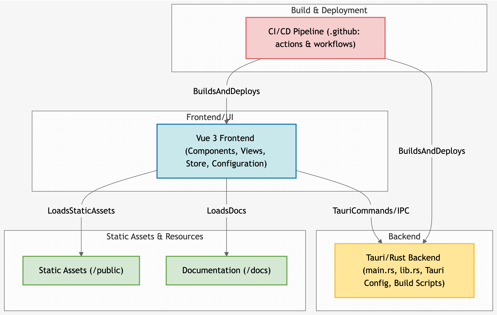

# MD-Tauri

<div align="center">
  
</div>

<div align="center">

[](https://github.com/CrazyMrYan/md-tauri/actions/workflows/code-review.yml)
[](https://github.com/CrazyMrYan/md-tauri/actions/workflows/cross-platform-build.yml)

[简体中文](README.md) | **English**

</div>

A modern Markdown editor built with Tauri and Vue 3, providing a seamless desktop experience for Markdown editing and preview.

## Features

- 🚀 Built with Tauri + Vue 3 for optimal desktop performance
- 📝 Real-time Markdown preview
- 🎨 Support for code syntax highlighting
- 📊 Mermaid diagram support
- 🧮 Mathematical formula rendering
- 🖼️ Multiple image upload options
- 💾 Auto-save drafts
- 🎯 Custom theme and CSS styling
- 📤 Import/Export functionality

## Installation Package

| System                                 | Package                                                                                 |
| -------------------------------------- | --------------------------------------------------------------------------------------- |
|    | [Download](https://github.com/CrazyMrYan/md-tauri/releases/latest) (.dmg)             |
|  | [Download](https://github.com/CrazyMrYan/md-tauri/releases/latest) (.msi)             |
|   | [Download](https://github.com/CrazyMrYan/md-tauri/releases/latest) (.deb)             |

## Diagram



## Development Setup

### Prerequisites

- Node.js >= 20
- Rust (for Tauri)
- Git

### Installation

```bash
# Clone the repository
git@github.com:CrazyMrYan/md-tauri.git
cd md-tauri

# Install dependencies
npm install
```

### Development Commands

```bash
# Start development server
npm run tauri:dev

# Build for production
npm run tauri:build

# Run web version (without Tauri)
npm run dev:web

# Lint files
npm run lint
```

## Build

To build the application for production:

```bash
npm run tauri:build
```

This will create platform-specific binaries in the `src-tauri/target/release` directory.

## Tech Stack

- Tauri
- Vue 3
- TypeScript
- Vite
- TailwindCSS
- CodeMirror
- Marked
- Mermaid
- And more...

## Contributing

1. Fork the repository
2. Create your feature branch (`git checkout -b feature/amazing-feature`)
3. Commit your changes (`git commit -m 'Add some amazing feature'`)
4. Push to the branch (`git push origin feature/amazing-feature`)
5. Open a Pull Request

## License

This project is open source and available under the [MIT License](LICENSE). 